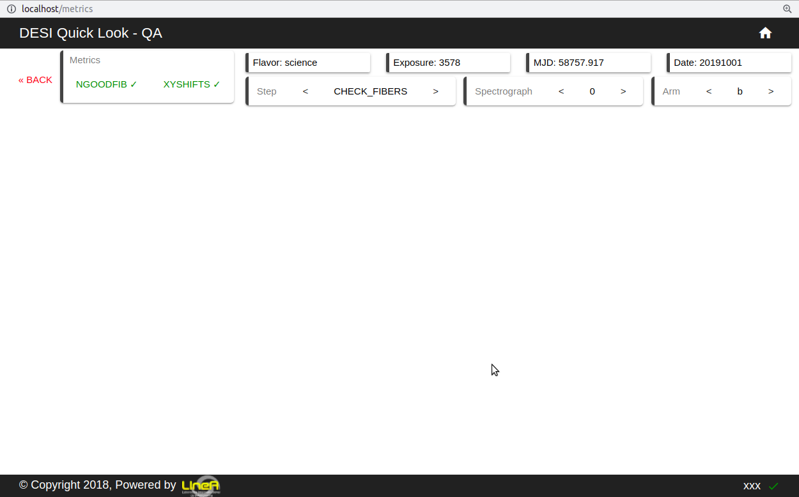
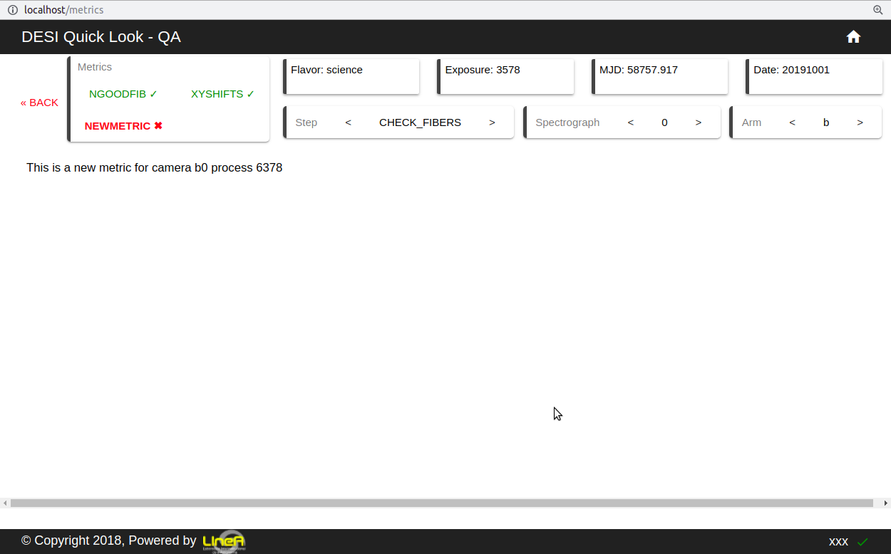

Bokeh Plots
============

Steps To Create A New Metric
-----------------------------

Let's create a new metric called ``NEWMETRIC`` in ``CHECK FIBERS`` step on a ``science`` flavor exposure.

.. _map-metric:

1. Create Map to Metric (Backend)
^^^^^^^^^^^^^^^^^^^^^^^^^^^^^^^^^^^

In order to understand how the plots end up in the frontend there are also `3 files`_ divided by ``Flavor`` mapping each python QA to the appropriate frontend stage and name.

.. _`3 files`: https://github.com/desihub/qlf/tree/master/backend/framework/ql_mapping

::

    qlf
    └── backend
        └── framework
            └── ql_mapping
                ├── arc.json
                ├── flat.json
                └── science.json

``/qlf/backend/framework/ql_mapping/science.json``

.. code-block:: javascript
   :emphasize-lines: 20,21,22,23,24,25

    {
    "flavor": "science",
    "step_list": [
        ...
            {
            "display_name": "CHECK FIBERS",
            "name": "CHECK_FIBERS",
            "start": "Starting to run step Flexure",
            "end": "Starting to run step ApplyFiberFlat_QP",
            "qa_list": [
                {
                "display_name": "NGOODFIB",
                "status_key": "NGOODFIB_STATUS",
                "name": "countbins"
                },
                {
                "display_name": "XYSHIFTS",
                "status_key": "XYSHIFTS_STATUS",
                "name": "xyshifts"
                },
                {
                "display_name": "NEWMETRIC",
                "status_key": "NEWMETRIC_STATUS",
                "name": "newmetric"
                }
            ]
        },
        ...
      ]
    }

*The new status will be detected and ingested on the next processings when* ``NEWMETRIC_STATUS`` *appears at ql logs*

2. Create NewMetric Folder
^^^^^^^^^^^^^^^^^^^^^^^^^^^

All `QA plots`_ are located in the same folder.

To add newmetric plots create a new folder with the following structure:

``qa`` + ``name``

.. _`QA plots`: https://github.com/desihub/qlf/tree/master/backend/framework/qlf/dashboard/bokeh

.. code-block:: text
   :emphasize-lines: 20,21

    qlf
    └── backend
        └── framework
            └── qlf
                └── dashboard
                    └── bokeh
                        ├── qacheckarc
                        ├── qacheckflat
                        ├── qacountbins
                        ├── qacountpix
                        ├── qagetbias
                        ├── qainteg
                        ├── qaskycont
                        ├── qaskypeak
                        ├── qaskyR
                        ├── qasnr
                        ├── qaxwsigma
                        ├── qaxyshifts
                        ├── plots
                        └── qanewmetric
                            └── main.py

* Each directory has a ``main.py`` file containing QA plots logic. To make new plots inside the QA they are the only place that will require changes.

* ``Plots`` diretory contains commonly used functions throughout QAs.

* Changes saved will trigger a bokeh reloaded automatically if the code is correctly mapped inse the container (:ref:`map-code-inside-container`).

3. NewMetric Plots Code
^^^^^^^^^^^^^^^^^^^^^^^^

Now adding actual python code for each plot. More details and examples in `jupyter notebooks directory`_.

.. _`jupyter notebooks directory`: https://github.com/desihub/qlf/tree/master/jupyter

``/qlf/backend/framework/qlf/dashboard/bokeh/qanewmetric/main.py``

.. code-block:: python

    from bokeh.layouts import column

    from bokeh.models.widgets import Div

    from bokeh.resources import CDN
    from bokeh.embed import file_html

    class NewMetric:
        def __init__(self, process_id, arm, spectrograph):
            self.selected_process_id = process_id
            self.selected_arm = arm
            self.selected_spectrograph = spectrograph

        def load_qa(self):
            cam = self.selected_arm+str(self.selected_spectrograph)

            layout = column(Div(text='This is a new metric for camera {} process {}'.format(cam, self.selected_process_id)), css_classes=["display-grid"])

            return file_html(layout, CDN, "NEWMETRIC")

4. Create Metric View
^^^^^^^^^^^^^^^^^^^^^^^^

1. Import the NewMetric QA class
2. Add a new qa view case inside ``views_bokeh.py``.

``/qlf/backend/framework/qlf/dashboard/views_bokeh.py``

.. code-block:: python
   :emphasize-lines: 7,39,40

    from dashboard.bokeh.fits2png.fits2png import Fits2png
    from dashboard.bokeh.qacountpix.main import Countpix
    from dashboard.bokeh.qagetbias.main import Bias
    from dashboard.bokeh.qagetrms.main import RMS
    ...
    from dashboard.bokeh.spectra.main import Spectra
    from dashboard.bokeh.qanewmetric.main import NewMetric
    from datetime import datetime, timedelta
    ...

    def load_qa(request):
        """Generates and render qas"""
        template = loader.get_template('dashboard/qa.html')
        # Generate Image
        qa = request.GET.get('qa')
        spectrograph = request.GET.get('spectrograph')
        process_id = request.GET.get('process_id')
        arm = request.GET.get('arm')
        try:
            if qa == 'qacountpix':
                qa_html = Countpix(process_id, arm, spectrograph).load_qa()
            elif qa == 'qabias':
                qa_html = Bias(process_id, arm, spectrograph).load_qa()
            elif qa == 'qarms':
                qa_html = RMS(process_id, arm, spectrograph).load_qa()
            elif qa == 'qaxwsigma':
                qa_html = Xwsigma(process_id, arm, spectrograph).load_qa()
            ...
            elif qa == 'qahdu':
                qa_html = 'No Drill Down'
            elif qa == 'qacheckflat':
                qa_html = Flat(process_id, arm,spectrograph).load_qa() #'No Drill Down'
            elif qa == 'qacheckarc':
                qa_html = Arc(process_id, arm,spectrograph).load_qa() #'No Drill Down'
            elif qa == 'qaxyshifts':
                qa_html = Xyshifts(process_id, arm,spectrograph).load_qa()
            elif qa == 'qaskyrband':
                qa_html = SkyR(process_id, arm,spectrograph).load_qa()
            elif qa == 'qanewmetric':
                qa_html = NewMetric(process_id, arm, spectrograph).load_qa()
            else:
                qa_html = "Couldn't load QA"
        except Exception as err:
            qa_html = "Can't load QA: {}".format(err)
        ...

5. Restart Backend
^^^^^^^^^^^^^^^^^^^

The backend server restarts automatically on each save but if you can't see the changes try (:ref:`restart-backend`)

6. Create Map to Metric (Frontend)
^^^^^^^^^^^^^^^^^^^^^^^^^^^^^^^^^^^

The metrics mappping also exist in the `frontend directory`_.

.. _`frontend directory`: https://github.com/desihub/qlf/tree/master/frontend/src/assets/ql_mapping

::

    qlf
    └── frontend
        └── src
            └── assets
                └── ql_mapping
                    ├── arc.json
                    ├── flat.json
                    └── science.json

Do :ref:`map-metric` in the according file.

7. Rebuild Frontend
^^^^^^^^^^^^^^^^^^^^^^

::

    ~/qlf$ docker-compose build nginx
    Building nginx
    ...
    Successfully built 22b9dc85a391
    Successfully tagged qlf_nginx:latest
    ~/qlf$ docker-compose up

*On the next exposure processed the QA will be available*

Result
^^^^^^^^

*Before*

|Before|

*After*

|After|

